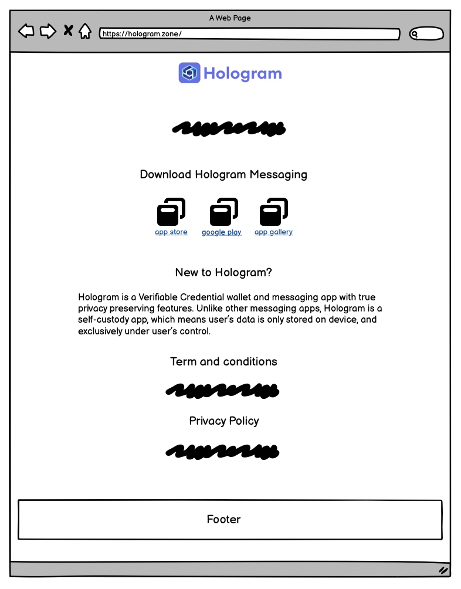
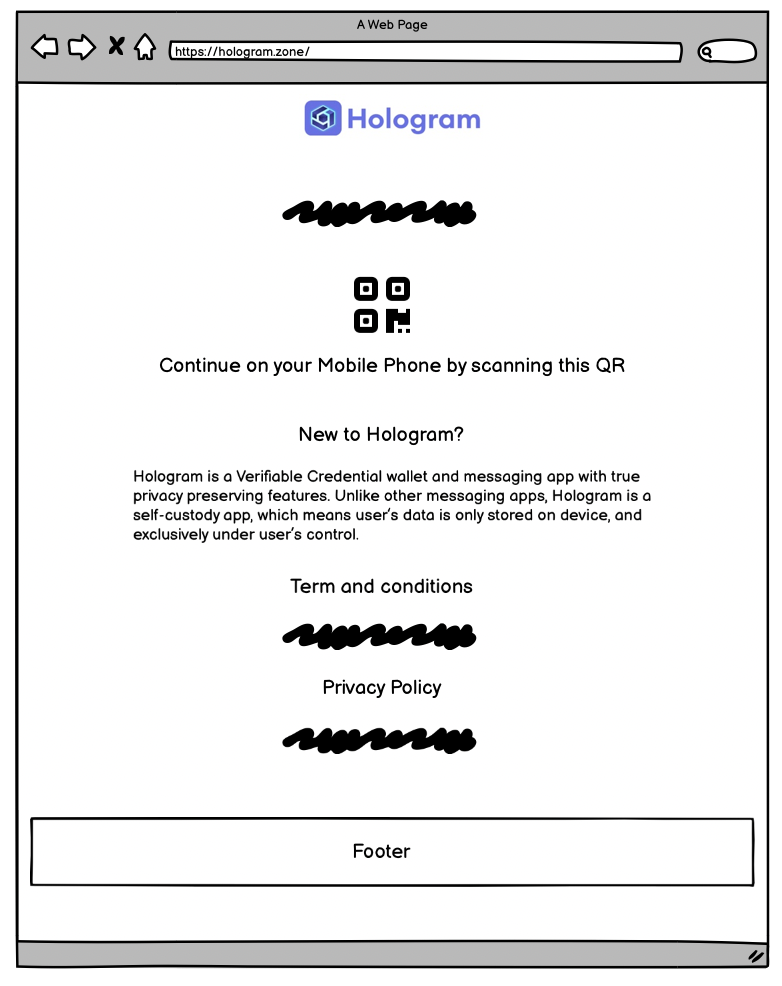
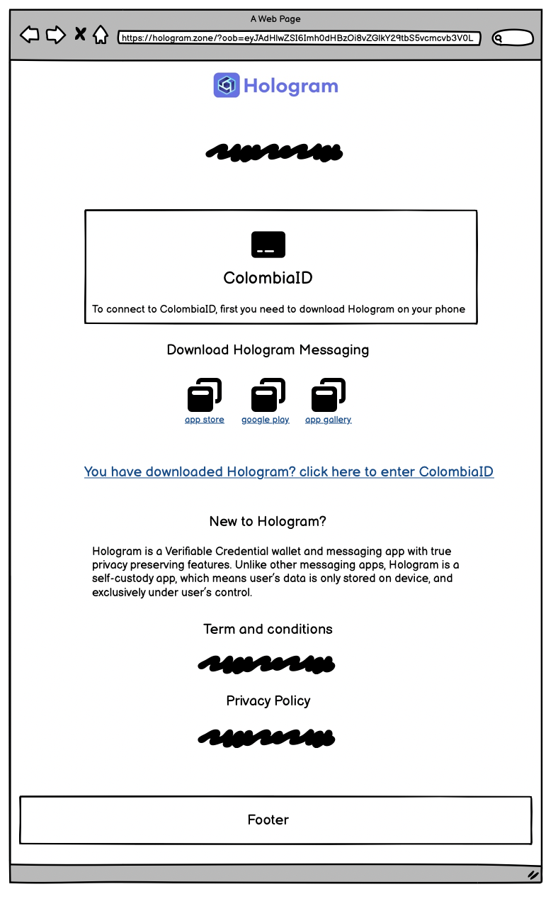
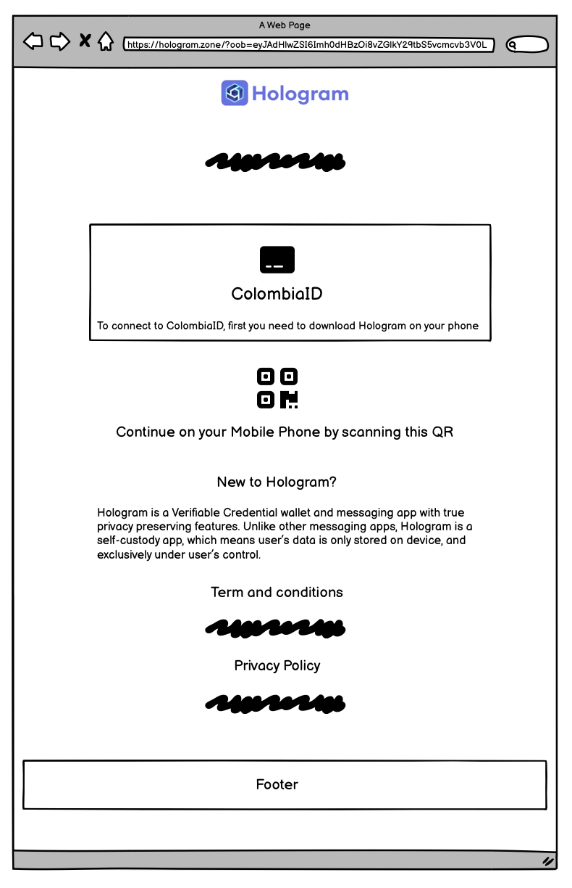

# Hologram.zone specs v1.0

**Specification Status:** [Pre-Draft](https://github.com/decentralized-identity/org/blob/master/work-item-lifecycle.md)

**Latest Draft:** [2060-io.github.io/hologram.zone-specs/](https://2060-io.github.io/hologram.zone-specs/)

**Editors:**

~ [Fabrice Rochette](https://www.linkedin.com/in/fabricerochette) (2060.io)

<!-- -->

**Participate:**

~ [GitHub repo](https://github.com/2060-io/hologram.zone-specs)

~ [File a bug](https://github.com/2060-io/hologram.zone-specs/issues)

~ [Commit history](https://github.com/2060-io/hologram.zone-specs/commits/main)

---

## About this Document

This document provides all the required information for:

- developing the logic (backend and frontend) of the hologram.zone website;
- delivering website design proposals, for choosing the right marketing message;
- realizing the design integration.

## Introduction

### What is Hologram?

*This section is non-normative.*

Hologram is a Verifiable Credential wallet and messaging app with true privacy preserving features. Unlike other messaging apps, Hologram is a self-custody app, which means user’s data is only stored on device, and exclusively under user’s control.

Hologram is available in the main app stores, look for "Hologram Messaging" in apple store, google play or huawei's app gallery.

### Why an hologram.zone website?

*This section is non-normative.*

This mini website is required to handle end-user fallback actions, such as when a user scans an hologram service QR, or click an hologram link, but Hologram app is not installed in user's handset.

### Conformance

As well as sections marked as non-normative, all authoring guidelines, diagrams, examples, and notes in this specification are non-normative. Everything else in this specification is normative.
The key words MAY, MUST, MUST NOT, OPTIONAL, RECOMMENDED, REQUIRED, SHOULD, and SHOULD NOT in this document are to be interpreted as described in [BCP 14](https://datatracker.ietf.org/doc/html/bcp14) [RFC2119](https://w3c.github.io/vc-data-model/#bib-rfc2119) [RFC8174](https://w3c.github.io/vc-data-model/#bib-rfc8174) when, and only when, they appear in all capitals, as shown here.

## Logic

*This section is non-normative.*

Look at these 2 use cases:

- User *clicks* an hologram link (DTS) from his mobile phone.
- User scans a QR representing an hologram link (DTS) from his mobile phone.

 In both case we are talking about the same URL. This URL is always be formatted as follows:

```
https://hologram.zone/?oob=QIUiudggiUQ..&tp=ABC

or

https://hologram.zone/?_oob=QIUiudggiUQ..&tp=ABC
```

where:

- `oob` (or `_oob`) (*mandatory*): is the out-of-band invitation to the DTS;
- `tp` (string) (*optional*): is an URL encoded parameter as specified in [[spec-norm:rfc3986]], used by DTSs to know from where the user is coming (advertising, etc).

### Hologram app is already installed on user's handset

Operating system SHOULD detect that the URL starts with https://hologram.zone/ (we definitely rely on it), and because the Hologram App registered this URL in the OS, OS SHOULD automatically open the Hologram App, and app MUST automatically process the URL content (`oob` and `tp` params).

::: note
Hologram.zone website is even not reached in this case.
:::

```plantuml
scale max 800 width
actor "User" as user 
participant "Browser" as browser
participant "Hologram App" as holo
participant "hologram.zone website" as hw #3fbdb6
participant "DTS" as dts 

user <-- browser: browser renders content of a website,\ncontent which includes a DTS link as specified\nabove https://hologram.zone/?oob=...
user --> browser: user clicks the link https://hologram.zone/?oob=
browser --> browser: app registered for https://hologram.zone/, open app
user <-- holo: connect to this DTS?
user --> holo: yes
holo --> dts: connect
```

### Hologram app is not installed on user's handset

In this case, because OS cannot find a registered App for the URL starting with https://hologram.zone?oob=..., browser loads the URL.

hologram.zone website MUST show a content to the user so that the following flow can be performed by the user:

```plantuml
scale max 800 width
actor "User" as user 
participant "Browser" as browser
participant "hologram.zone website" as hw #3fbdb6
participant "Hologram App" as holo
participant "app store" as apps
participant "DTS" as dts 

user <-- browser: browser renders content of a website,\ncontent which includes a DTS link as specified\nabove https://hologram.zone/?oob=...
user --> browser: user clicks the link https://hologram.zone/?oob=
browser --> browser: no app registered for https://hologram.zone/
browser --> hw: browser loads https://hologram.zone/?oob=
browser <-- hw: hologram.zone return content
user <-- browser: browser shows content to user:\n- please download app to continue\n- link connect to service when app is downloaded\n(same https://hologram.zone/?oob=... URL that\nthe user clicked to arrive here)
user --> apps: get Hologram
user <-- apps: downloaded hologram
user --> holo: open app and create wallet
user --> browser: user clicks the link https://hologram.zone/?oob=...\nin original page\nOR in hologram.zone website
browser --> browser: app registered for https://hologram.zone/, open app
user <-- holo: connect to this DTS?
user --> holo: yes
holo --> dts: connect
```

## Pages

The website MUST be a single-page website.
We have 4 notable cases.

### Case #1: when user arrive spontaneously in website (no DTS invitation in URL), mobile phone

User was directed to https://hologram.zone/.

The website MUST show:

- A **short** explanation of what is Hologram
- Links to download the App from one of the 3 major stores, Apple, Google, Huawei, or by downloading the apk.
- Terms and conditions (anchor link, https://hologram.zone/#terms)
- Privacy policy (anchor link, https://hologram.zone/#privacy)
- A footer with copyright, etc



### Case #2: when user arrive spontaneously in website (no DTS invitation in URL), desktop or tablet

User was directed to https://hologram.zone/.

The website MUST show:

- A **short** explanation of what is Hologram
- A QR code of this URL, with a text "Continue on your Mobile Phone"
- Terms and conditions (anchor link, https://hologram.zone/#terms)
- Privacy policy (anchor link, https://hologram.zone/#privacy)
- A footer with copyright, etc



### Case #3: User arrives with a DTS invitation in URL, from a mobile phone

User was directed to https://hologram.zone/?oob=QIUiudggiUQ..&tp=ABC

The website MUST show:

- A **short** explanation of what is Hologram
- download link to the 3 major stores, Apple, Google, Huawei.
- click to connect when downloaded. (same https://hologram.zone/?oob=QIUiudggiUQ..&tp=ABC), but because app will now be installed, link will be opened by app.
- Terms and conditions (anchor link, https://hologram.zone/#terms)
- Privacy policy (anchor link, https://hologram.zone/#privacy)
- A footer with copyright, etc




### Case #4: User arrives with a DTS invitation in URL, desktop or tablet

User was directed to https://hologram.zone/?oob=QIUiudggiUQ..&tp=ABC

The website MUST show:

- A **short** explanation of what is Hologram
- A QR code of this URL, with a text "Continue on your Mobile Phone"
- Terms and conditions (anchor link, https://hologram.zone/#terms)
- Privacy policy (anchor link, https://hologram.zone/#privacy)
- A footer with copyright, etc



### Getting service name and icon

To be able to render the service name and icon, we MUST try to get the `label` and `imageUrl` attributes in the `oob` or `_oob` parameter. First, we need to decode its base64.

Example:

```
eyJAdHlwZSI6Imh0dHBzOi8vZGlkY29tbS5vcmcvb3V0LW9mLWJhbmQvMS4xL2ludml0YXRpb24iLCJAaWQiOiJkOWRlMTU5Yy0zNTk5LTQ5ZDAtOGQ0Zi0zZjY5NTAzYzc3MjMiLCJsYWJlbCI6IkRlbW8gQ2hhdGJvdCBBZ2VudCIsImFjY2VwdCI6WyJkaWRjb21tL2FpcDEiLCJkaWRjb21tL2FpcDI7ZW52PXJmYzE5Il0sImhhbmRzaGFrZV9wcm90b2NvbHMiOlsiaHR0cHM6Ly9kaWRjb21tLm9yZy9kaWRleGNoYW5nZS8xLjEiLCJodHRwczovL2RpZGNvbW0ub3JnL2Nvbm5lY3Rpb25zLzEuMCJdLCJzZXJ2aWNlcyI6WyJkaWQ6d2ViOmNoYXRib3QtZGVtby5kZXYuMjA2MC5pbyJdLCJpbWFnZVVybCI6Imh0dHBzOi8vZC5jaGF0Ym90LWRlbW8uZGV2LjIwNjAuaW8vYXZhdGFyLnBuZyJ9
```

will be decoded to:

``` json
{
   "@type":"https://didcomm.org/out-of-band/1.1/invitation",
   "@id":"d9de159c-3599-49d0-8d4f-3f69503c7723",
   "label":"Demo Chatbot Agent",
   "accept":[
      "didcomm/aip1",
      "didcomm/aip2;env=rfc19"
   ],
   "handshake_protocols":[
      "https://didcomm.org/didexchange/1.1",
      "https://didcomm.org/connections/1.0"
   ],
   "services":[
      "did:web:chatbot-demo.dev.2060.io"
   ],
   "imageUrl":"https://d.chatbot-demo.dev.2060.io/avatar.png"
}
```

#### If oob message has "@type":"https://didcomm.org/out-of-band/1.1/invitation" attribute

Extract the info like this:

- `label`: "Demo Chatbot Agent"
- `imageUrl`: "https://d.chatbot-demo.dev.2060.io/avatar.png".

#### If oob message has "type": "https://didcomm.org/out-of-band/2.0/invitation" attribute

At the moment, the page MUST just show the link to connect, saying "continue to service", as name and imageUrl cannot be extracted.

#### Show found information on screen

Based on the information it was possible to get, the maximum possible info MUST be shown.

## Internationalization

Website MUST detect browser's language and render the website in the language of the browser if possible, else MUST fallback to english.

Texts and other internationalizable elements MUST be in a directory/files organized by language so that anyone can fork the project or create a branch and add a new language.

## Design

The design MUST be delivered in figma.

Screen captures here:


## Repo, packaging and deployment

Development lifecycle must adhere to the [organization rules](https://github.com/2060-io/organization/blob/main/basic-rules.md).

When a tag is created from the main branch, it MUST deploy to github pages.

Repo for website MUST be named `hologram.zone-website`.

## References

### Normative References

[[spec-norm]]
